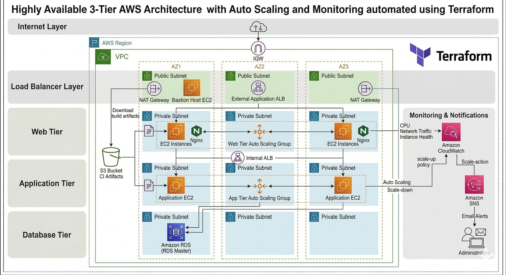

# Highly Available AWS 3-Tier Architecture (Terraform)

This project demonstrates how to design and deploy a **production-style highly available AWS infrastructure** using **Terraform (Infrastructure as Code)**.

The architecture is built following **cloud best practices**, including **network segmentation, auto scaling, monitoring, and automated infrastructure provisioning**.

---

## Architecture Overview

The infrastructure is deployed across **3 Availability Zones** to ensure **high availability and fault tolerance**.

Architecture layers include:

- VPC with Public and Private Subnets
- Internet Gateway and NAT Gateway
- External Application Load Balancer
- Internal Application Load Balancer
- Web Tier
- Application Tier
- Database Tier (Amazon RDS)
- Auto Scaling
- Monitoring and Alerts

Traffic flow:

---

## Architecture Diagram

---

## Key Features

### High Availability
- Infrastructure spans **3 Availability Zones**
- Load balancing distributes traffic across instances
- Multi-AZ database deployment

### Infrastructure as Code
All infrastructure is provisioned using **Terraform**.

Benefits:
- Reproducible environments
- Version-controlled infrastructure
- Automated provisioning

### Network Design
- Custom **VPC**
- **Public Subnets**
  - External Load Balancer
  - NAT Gateway
- **Private Subnets**
  - Web Tier
  - Application Tier
  - Database Tier

Database subnets are **fully isolated with no internet access**.

### Load Balancing
- **External Application Load Balancer**
  - Handles incoming internet traffic

- **Internal Application Load Balancer**
  - Handles communication between Web and App tiers

### Reverse Proxy
The **Web tier uses Nginx as a reverse proxy** to route internal requests to the application tier.

### Auto Scaling
Auto Scaling Groups are configured for:

- Web Tier
- Application Tier

Scaling behavior:

- High traffic → scale up instances
- Low traffic → scale down instances

### Application Deployment
EC2 instances run a startup script to:

- Download application build artifacts from **Amazon S3**
- Deploy the application automatically

### Monitoring and Alerts
Monitoring is implemented using **Amazon CloudWatch**.

CloudWatch monitors:

- CPU Utilization
- Network Traffic
- Instance Health

### Notifications
CloudWatch Alarms trigger **Amazon SNS notifications**, which send **email alerts** to administrators.

---

## Technologies Used

- AWS VPC
- AWS EC2
- AWS Auto Scaling
- AWS Application Load Balancer
- AWS RDS
- AWS S3
- AWS CloudWatch
- AWS SNS
- Terraform
- Nginx

---

---

